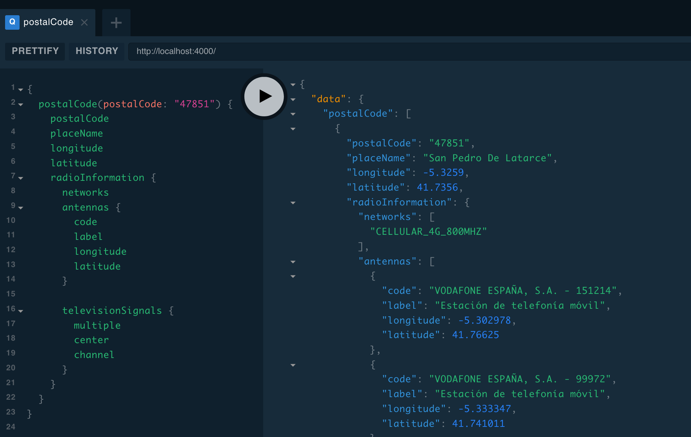

# eGov España - API de acceso a datos púbicos

[](https://travis-ci.org/palmerabollo/egov)

¿Te entra la risa floja cuando oyes hablar de transformación digital? ¿Ya no crees en promesas de datos abiertos? ¿Crees que está feo dilapidar dinero público en "portalitos"? Estás en el sitio adecuado.

El plan es **construir APIs decentes que consulten fuentes de datos públicas** (por ejemplo, páginas web) para poder utilizar los servicios de la administración de forma programática.

Prueba a consultar algunos ejemplos en una demo real:
* [Ubicación geográfica del código postal "09400"](https://bit.ly/egov-demo-1).
* [Antenas de telefonía de Aranda de Duero](http://bit.ly/egov-demo-2).
* [Señales de Televisión de Villadiego](http://bit.ly/egov-demo-3).
* [Cobertura 4G a 800MHz en Aranda de Duero](http://bit.ly/egov-demo-4).

Faltan muchos servicios por incluir y no voy a poder hacerlo solo. **¡Colabora!**

# Organización del proyecto

El proyecto se divide en varios paquetes:
- **packages/egov-api-server**: Servidor que expone un API [GraphQL](https://en.wikipedia.org/wiki/GraphQL) para acceder a los datos públicos.
- **packages/egov-data-providers**: Contiene los servicios de consulta que extraen datos de fuentes públicas. El `egov-api-server` utiliza este paquete.
- **packages/egov-examples**: Ejemplos de uso programático de los servicios de consulta.

## egov-api-server

Servidor HTTP que expone un **API GraphQL para acceder a datos públicos reales** ([probar demo](https://bit.ly/egov-demo)). Está desarrollado en Node.js (TypeScript) con [Apollo GraphQL](https://www.apollographql.com/docs/) y es la forma más sencilla de acceder a los datos.



Puedes consultar el [esquema de datos](./packages/egov-api-server/src/index.ts). He empezado con datos de localizaciones geográficas y de servicios de telecomunicaciones disponibles en la zona (antenas, canales de televisión digital, redes disponibles).

### Instalación local

Sólo necesitas [Node.js 10+](https://nodejs.org/es/download/). Debes inicializar el proyecto después de clonarlo por primera vez:

```
git clone git@github.com:palmerabollo/egov.git
cd egov
npm install
````

Y ejecutarlo:
```
npm run start:api-server
```

En http://localhost:4000 tendrás la interfaz web de acceso al API GraphQL para ejecutar tus consultas.

## egov-data-providers

Incluye la implementación de los proveedores de datos: servicios de consulta que extraen datos de fuentes públicas. Algunos servicios consultan datos cuando se solicitan (online) y otros utilizan datos locales (offline).

Crear un nuevo servicio es muy sencillo. Actualmente están desarrollados los siguientes. Echa un vistazo y propón nuevas [ideas en las issues](https://github.com/palmerabollo/egov/issues?q=is%3Aissue+is%3Aopen+label%3Aideas-providers) o envía tu _pull request_ con nuevos servicios. Es muy fácil.

| Servicio     | Clase | Origen de los datos   | Online  |
|------------- | ------| --------------------- | ------- |
| Búsqueda de poblaciones y códigos postales<br><i>Categoría: General</i> | `PostalCodeService` | geonames.org | ❎<br><small>(local file)</small> |
| Localización de antenas de telefonía móvil<br><i>Categoría: Telco</i> | `AntennaService` | geoportal.minetur.gob.es | ✅<br><small>(api)</small >|
| Comprobación de cobertura 4G a 800MHz<br><i>Categoría: Telco</i> | `NetworkService` | www.llega800.es | ✅<br><small>(api)</small> |
| Señales de televisión por ubicación geográfica<br><i>Categoría: Telco</i> | `DigitalTelevisionService` | www.televisiondigital.gob.es | ✅<br><small>(html)</small> |
| Radares de tráfico<br><i>Categoría: Tráfico</i> | `TrafficRadarService` | www.dgt.es | ✅<br><small>(html, pdf file)</small> |

## egov-examples

Ejemplos de uso programático de los servicios de consulta disponibles en `egov-data-providers`.

```typescript
import * as egov from '@egov/data-providers';

let service = new egov.AntennaService();
let antennas = await service.findAntennas(41.73, -5.32);

console.table(antennas, ['code', 'latitude', 'longitude']);

// output
// ┌─────────┬───────────────────────────────────┬───────────┬───────────┐
// │ (index) │               code                │ latitude  │ longitude │
// ├─────────┼───────────────────────────────────┼───────────┼───────────┤
// │    0    │ 'VODAFONE ESPAÑA, S.A. - 144588'  │ 41.471472 │ -4.989911 │
// │    1    │ 'VODAFONE ESPAÑA, S.A. - 144589'  │ 41.479806 │ -5.048222 │
// │    2    │ 'ORANGE ESPAGNE, SAU - CYLR2147A' │ 41.471472 │ -4.989911 │
// │    3    │ 'ORANGE ESPAGNE, SAU - CYLR2223B' │ 41.479806 │ -5.048222 │
// └─────────┴───────────────────────────────────┴───────────┴───────────┘
```

# TODO

- [ ] Prueba de concepto para soportar providers implementados en Pyton.
- [ ] Librería y utilidades para facilitar web scraping.
- [ ] Tests para detectar cambios de estructura html que hagan fallar los "scrapers".
- [ ] Añadir guías de colaboración.
- [ ] Imagen Docker + publicar en npm registry para reducir curva de iniciación.
- [ ] ...

# LICENSE

Copyright 2019 - Guido García (guido.garcia AT protonmail DOT com)

Licensed under the GNU Affero General Public License, Version 2.0 (the "License"); you may not use this file except in compliance with the License.

## Third parties

Some information about postal codes is provided by [geonames](www.geonames.org) under a [Creative Commons Attribution 4.0 License](http://creativecommons.org/licenses/by/4.0/).
