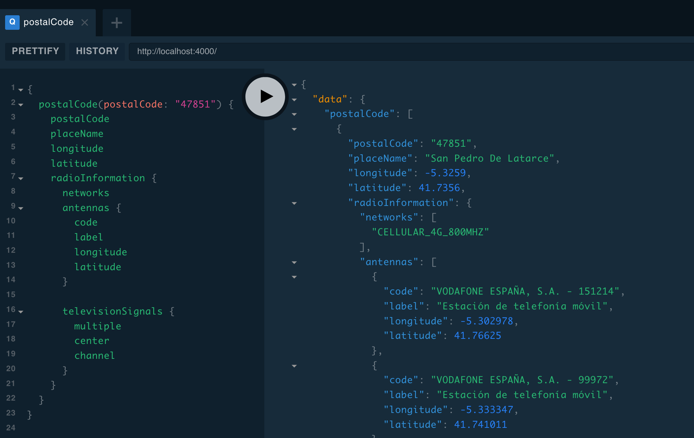

# eGov España - API de acceso a datos púbicos

¿Te entra la risa floja cuando oyes hablar de transformación digital? ¿Ya no crees en promesas de datos abiertos? ¿Crees que está feo dilapidar dinero público en "portalitos"? Estás en el sitio adecuado.

El plan es construir APIs decentes que consulten fuentes de datos públicas (por ejemplo, páginas web)  para poder utilizar los servicios de la administración de forma programática. Puedes [probar la demo real](https://bit.ly/egov-demo).

No voy a poder hacerlo sólo. **¡Colabora!**

# Organización del proyecto

El proyecto cuenta con varios paquetes:
- **packages/egov-api-server**: Servidor que expone un API [GraphQL](https://en.wikipedia.org/wiki/GraphQL) para acceder a los datos.
- **packages/egov-data-providers**: Servicios de consulta que extraen datos de fuentes públicas.
- **packages/egov-examples**: Ejemplos de uso programático de los servicios de consulta.

## egov-api-server

Servidor HTTP que expone un **API GraphQL para acceder a datos públicos reales** ([probar demo](https://bit.ly/egov-demo)). Está desarrollado en Node.js (TypeScript) con [Apollo GraphQL](https://www.apollographql.com/docs/) y es la forma más sencilla de acceder a los datos.



Puedes consultar el [esquema de datos](./packages/egov-api-server/src/index.ts). Actualmente está centrado en datos de localizaciones geográficas y de servicios de telecomunicaciones disponibles en la zona (antenas, canales de televisión digital, redes disponibles).

### Instalación local

Sólo necesitas [Node.js 10+](https://nodejs.org/es/download/). Debes inicializar el proyecto después de clonarlo por primera vez:

```
git clone git@github.com:palmerabollo/egov.git
cd egov
npm install
````

Y ejecutarlo:
```
npm run watch:api-server
```

En http://localhost:4000 tendrás una interfaz de acceso al API GraphQL para ejecutar tus consultas.

## egov-data-providers

Servicios de consulta que extraen datos de fuentes públicas. Algunos servicios consultan datos cuando se solicitan (online) y otros utilizan datos locales (offline).

Crear un servicio es muy sencillo. Actualmente están desarrollados los siguientes, y se aceptan pull requests con nuevos servicios.

| Servicio     | Origen de los datos   | Online  |
|------------- | --------------------- | ------- |
| Búsqueda de poblaciones y códigos postales<br><i>Categoría: General</i> | geonames.org | ❎<br><small>(file)</small> |
| Servicio de localización de antenas de telefonía móvil<br><i>Categoría: Telco</i> | geoportal.minetur.gob.es | ✅<br><small>(api)</small >|
| Servicio de comprobación de cobertura 4G a 800MHz<br><i>Categoría: Telco</i> | www.llega800.es | ✅<br><small>(api)</small> |
| Señales de televisión por ubicación geográfica<br><i>Categoría: Telco</i> | www.televisiondigital.gob.es | ✅<br><small>(html)</small> |

## egov-examples

Ejemplos de uso programático de los servicios de consulta disponibles en `egov-data-providers`.

```typescript
import * as egov from '@egov/data-providers';

let service = new egov.AntennaService();
let antennas = await service.findAntennas(41.73, -5.32);

console.table(antennas, ['code', 'latitude', 'longitude']);

// output
// ┌─────────┬───────────────────────────────────┬───────────┬───────────┐
// │ (index) │               code                │ latitude  │ longitude │
// ├─────────┼───────────────────────────────────┼───────────┼───────────┤
// │    0    │ 'VODAFONE ESPAÑA, S.A. - 144588'  │ 41.471472 │ -4.989911 │
// │    1    │ 'VODAFONE ESPAÑA, S.A. - 144589'  │ 41.479806 │ -5.048222 │
// │    2    │ 'ORANGE ESPAGNE, SAU - CYLR2147A' │ 41.471472 │ -4.989911 │
// │    3    │ 'ORANGE ESPAGNE, SAU - CYLR2223B' │ 41.479806 │ -5.048222 │
// └─────────┴───────────────────────────────────┴───────────┴───────────┘
```


# TODO

- [ ] Comentárselo a 5-10 personas para ver qué opinan y recoger ideas.
- [ ] Añadir guías de colaboración.
- [ ] Tests para detectar cambios de estructura que hagan fallar los "scrapes".
- [ ] Integrar CI/Travis.
- [ ] Imagen Docker + publicar en npm registry para reducir curva de iniciación.
- [ ] ...

# LICENSE

Copyright 2019 - Guido García Bernardo

Licensed under the GNU Affero General Public License, Version 2.0 (the "License"); you may not use this file except in compliance with the License.

## Third parties

Some information about postal codes is provided by [geonames](www.geonames.org) under a [Creative Commons Attribution 4.0 License](http://creativecommons.org/licenses/by/4.0/).